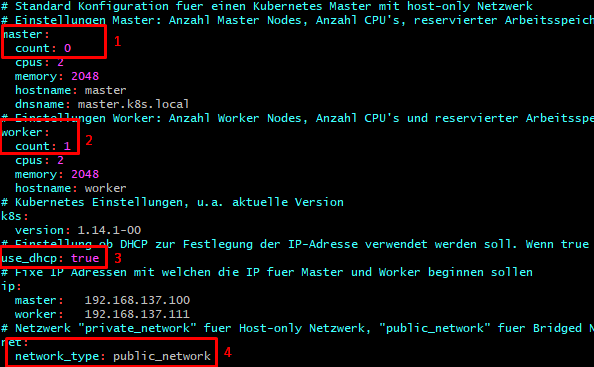

# Modul 300 - Plattformübergreifende Dienste in ein Netzwerk integrieren

In dieser Dokumentation weise ich die einzelnen Kompetenzen für die Lerbeurteilung 3 nach.

WICHTIGE INFORMATIONEN IM VORAUS:
Ich habe immer eine Vagrant-VM erstellt, auf der ich dann die Docker-Container laufen lassen habe.

## Inhaltsverzeichnis

* K1 - [Toolumgebung aufsetzen](#k1)
* K2 - [Lernumgebung einrichten](#k2)
* K3 - [Vagrant Vertiefung](#k3)
* K4 - [Sicherheit implementieren](#k4)
* K5 - [Zusätzliche Bewertungspunkte](#k5)
* K6 - [Zusätzliche, systemtechnische Bewertungspunkte](#k6) 

## Toolumgebung aufsetzen <a name="k1"></a>

- [x] VirtualBox installiert
- [x] Vagrant installiert
- [x] Visualstudio-Code installiert
- [x] Git-Client installiert
- [x] SSH-Key für Client erstellt

## Lernumgebung einrichten <a name="k2"></a>

- [x] GitHub-Account ist erstellt
- [x] Git-Client wurde verwendet
- [x] Dokumentation ist als Markdown vorhanden
- [x] Markdown-Editor ausgewählt und eingerichtet (Visualstudio-Code) 

- [x] Persönlicher Wissensstand zu den wictigsten Themen ist dokumentiert:

### Persönlicher Wissensstand

Ich weiss in der Theorie wie Docker funktioniert und kann erklären wie es funktioniert (Abgeschottete Systeme welche sich von den Ressourcen des Host-Systemes bedienen etc.)
Ich habe in der Praxis vor diesem Modul noch NIE mit Docker gearbeitet und bin sehr gespannt was sich aus den Lektionen in diesem Modul ergeben wird.

### Containerisierung

Container sind "virtuelle Maschinen" welche sich die Ressourcen mit dem Host-Betriebssystem teilen und deshalb sehr wenig Bedarf an Speicherplatz haben.
Container sind leichtgewichtig und können in weniger als einer Sekunde gestartet werden.

Der Vorteil von Containern ist, dass sie von anderen Containern und Systemen auf dem Host-PC abgeschottet sind, weshalb sie überall gleich laufen.
Deshalb hat man dank Containern kein Problem mehr wo die Software zwar auf der Test & Staging Plattform problemlos läuft, jedoch genau auf der Prod-Plattform nicht.

Das Leben von Containern ist direkt an deren Hauptprozzess gebunden.
Dies bedeutet, dass wenn der Hauptprozzess beendet wird oder stirbt, der Container heruntergefahren wird.

### Docker

Docker ist eine Applikation um Container zu erstellen, zu verwalten, zu bedienen und zu löschen.

Man kann ein beliebiges Docker-Image von Dockerhub (https://hub.docker.com/) herunterladen und damit einen Container erstellen und direkt starten.
Oder man kann mithilfe eines "Dockerfiles" ein Image von Dockerhub herunterladen und dieses Image dann noch verändern.

Beispielsweise kann man Alpine Linux installieren und danach noch On-Top einen Webserver installieren. Das Dockerfile würde dann wie folgt aussehen:

```
FROM alpine:3.10.0
EXPOSE 80
RUN apk add apache2 && rc-service apache2 start
```

Aus diesem Dockerfile wird dann ein eigenes Image erzeugt, wo beim Start direkt der Webserver heruntergeladen & gestartet wird.
Dies ist ein sehr simples Dockerfile, die Möglichkeiten sind bei Docker weit umfangreicher.

### Microservices

"Microservices" ist der Begriff für einen Architekturstil in der Informatik.
Es geht dabei darum, dass man ein grosses System strukturiert und ganz klar in kleinere Services unterteilt.
So kann man dann ganz einfach kleinere Teams zusammenstellen, wobei jedes einzelne Team für einen Microservice zuständig ist.

Beispiel:
Bei Amazon könnte die Unterteilung in Microservices gemacht werden mit Bestellungsservice - Wunschliste - Zahlungsprozzessverarbeitung etc.

## (Eigene) Docker-Projekte <a name="k3"></a>

### Bestehende Docker-Container kombinieren / Bestehende Container als Backend, Desktop-App als Frontend einsetzen

Wir wollen als erstes zwei Docker-Container miteinander kombinieren. Dabei soll der eine Container ein Webfrontend mit Webserver enthalten, während der andere Container die Datenbank, also das Backend enthält.

Die nötigen Docker-Images können direkt beim Erstellen der VM heruntergeladen werden.
```
# Docker Provisioner
    config.vm.provision "docker" do |d|
      d.pull_images "mysql:8.0.16"
      d.pull_images "ghost:2.25.1-alpine"
```

Danach startet man die Vagrant-VM
```
vagrant up
```

Da wir die nötigen Docker-Images nun bereits beim Starten der Vagrant-VM heruntergeladen haben können wir direkt die beiden Docker-Container mit "docker run" starten.
```
docker run -d --name ghost_mysql -p 3306:3306 -p 8080:80 -e MYSQL_ROOT_PASSWORD=barth -e MYSQL_USER=ghost -e MYSQL_PASSWORD=barth -e MYSQL_DATABASE=ghost mysql:8.0.16 --restart-always

docker run -d --name ghost -p 2368:2368 --link ghost_mysql:mysql -e database_client=mysql -e database__connection__host=ghost_mysql -e database__connection__user=ghost -e database__connection__password=barth -e database__connection__database=ghost ghost:2.25.1-alpine --restart=always
```

Durch das öffnen der Ports mit dem "-p"-Parameter und dem Link vom "ghost_mysql"-Container zum "mysql"-Container sind die beiden Container miteinander verbunden und können miteinander kommunizieren.
Man kann diese Commands entweder über Bash ausführen oder direkt im Vagrantfile im Docker Provisioning, siehe weiter unten:
```
d.run "ghost_mysql", image: "mysql:5.7", args: "-e MYSQL_ROOT_PASSWORD=admin -e MYSQL_USER=ghost -e MYSQL_PASSWORD=secret -e MYSQL_DATABASE=ghost --restart=always"
d.run "ghost", image: "ghost:1-alpine", args: "--link ghost_mysql:mysql -e database__client=mysql -e database__connection__host=ghost_mysql -e database__connection__user=ghost -e database__connection__password=secret -e database__connection__database=ghost -p 2368:2368 --restart=always"
```

### Eigene Docker Container erstellen

Siehe Verzeichnis: **eigene_umgebung**

Ich habe eine Docker-Umgebung mit Vagrant eingerichtet, auf welcher sich ein Apache-Container und ein MYSQL-Container befindet. Beide Container können miteinander interagieren.

#### Vagrantfile

Ich werde die verschiedenen Abschnitte aus dem Vagrantfile erläutern. Aus Übersichtsgründen werde ich jedoch nicht das ganze Vagrantfile abbilden, dies kann auch so separat angeschaut werden.

Als Base-Image habe ich Ubuntu (Xenial64) definiert.
```
config.vm.box = "ubuntu/xenial64"
```

Im nächsten Abschnitt habe ihc einige wichtige Ports weitergeleitet, welche für mein Projekt gebraucht werden.
```
    config.vm.network "forwarded_port", guest:80, host:8080, auto_correct: true
    config.vm.network "forwarded_port", guest:8081, host:8081, auto_correct: true
    config.vm.network "forwarded_port", guest:8082, host:8082, auto_correct: true
    config.vm.network "forwarded_port", guest:3306, host:3306, auto_correct: true  
    for i in 32760..32780
      config.vm.network :forwarded_port, guest: i, host: i
    end
```

Der Hostname der VM wird schlichtweg zu "docker" gesetzt.
Das Vagrantfile richtet noch einen zusätzlichen Netzwerkadapter ein, der eine Private IP aus Klasse C hat.
Als VM-Provider benutze ich VirtualBox.
```
    config.vm.hostname = "docker"
    config.vm.network "private_network", ip:"192.168.60.101"
```
```
config.vm.provider "virtualbox" do |vb|
       vb.memory = "2048"
    end
```

Damit Files zwischen Host- und Gastbetriebssystem geteilt werden können richte ich für die Vagrant-VM einen Shared-Folder ein.
```
    config.vm.synced_folder "shared_folder/", "/home/vagrant/shared_folder"
```

Für mein Projekt brauche ich einmal ein MySQL-Image und ein PHP/Apache-Image. Diese werden durch das Vagrantfile im foldenen Abschnitt heruntergeladen.
```
    config.vm.provision "docker" do |d|
      d.pull_images "mysql:8.0.16"
      d.pull_images "php:7.4.0alpha1-apache-stretch"
    end
```

Nun starte ich die Vagrant-VM, wo sich nach erstem Boot Docker darauf befinden soll, mit folgendem Command:
```
vagrant up
```

#### In der Docker-VM

Ich habe eine VM mit Docker und bereits heruntergeladenen Images aus dem vorherigen Schritt. Nun startet man die Docker-Container mit den folgenden Befehlen:

```
docker run -d --name databaseserver -e MYSQL_ROOT_PASSWORD=barth --expose 3306 mysql:8.0.16

docker run -d --name webserver -p 80:8080 --expose 80 --expose 3306 --link databaseserver:webserver php:7.4.0alpha1-apache-stretch
```

Erklärungen:
* "-d"-Parameter startet den Container im detached-Mode
* --name legt den Namen des Containers fest
* "-e"-Parameter um eine Umgebungsvariable zu setzen
* --expose um im Container einen Port zu öffnen

Die beiden Docker-Container laufen nun, jedoch kann man diese mit weniger langen Commands starten, wenn man ein selber gebuildetes Image durch ein Dockerfile gebuildet hat (siehe nächster Schritt).

#### Images mit Dockerfile builden

Wie bereits erwähnt will man nicht immer so lange Commands eintippen und die Docker-Container einfacher starten können. Dies tut man durch Dockerfiles. Weiter unten habe ich die Dockerfiles für die beiden Docker-Container, welche ich im vorherigen Schritt gestartet habe, zitiert.

Dockerfile für den Database-Server:
```
## Base-Image definieren ##
FROM mysql:8.0.16
## Ports auf dem Container freigeben ##
EXPOSE 3306
## Wichtige Umgebungsvariablen setzen ##
ENV MYSQL_ROOT_PASSWORD barth
```

Dockerfile für den Webserver:
```
## Base-Image definieren ##
FROM php:7.4.0alpha1-apache-stretch
## Ports auf dem Container freigeben ##
EXPOSE 80
EXPOSE 3306
## Wichtige Umgebungsvariablen setzen ##
ENV APACHE_RUN_USER www-data
ENV APACHE_RUN_GROUP www-data
ENV APACHE_LOG_DIR /var/log/apache2
```

Da ich nicht mit "docker-compose" arbeite habe ich zwei separate Dockerfiles erstellt. 
Nun können aber die Images mit folgenden Commands gebuildet werden.

```
cd ./shared_folder/dockerfiles/db/
docker build -t databaseserver_image:version01 .
cd ./shared_folder/dockerfiles/web/
docker built t webserver_image:version01 .
```

Danach können die beiden Docker-Container durch die eigen gebauten Images mit den folgenden Commands gestartet werden:
```
docker run -d --name databaseserver databaseserver_image:version01
docker run -d --name webserver -p 80:8080 --link databaseserver:webserver webserver_image:version01
```

#### Ergänzungen zum MySQL-Image (Weitere Umgebungsvariablen)

In der Übung wo Docker-Container kombiniert 

#### Commands durch Dockerfile ausführen (MySQL-Client auf Webserver )

#### cgi script einrichten

#### Volle automation durch bash script

### Volumes zur persistenten Datenablage eingerichtet

Es gibt bei Docker verschiedene Arten Volumes zur dauerhaften Ablage von Daten zu erstellen.
Für meine Docker-Umgebung habe ich ein Named-Volume für den Webserver-Container entschieden.

Das Volume soll mit dem Verzeichnis /var/www/html persistent speichern.

Um ein "Named Volume" zu erstellen gibt man folgenden Command ein:
```
docker volume create html
```

Danach kann man den Webserver-Container mit dem folgenden Command starten. Durch den "-v"-Parameter wird das Volume gemountet.
```
docker run -d --name webserver -v html:/var/www/html -p 80:8080 --link databaseserver:webserver webserver_image:version01
```

Parameter Erklärung:
-v [VOLUME]:[VM_DIRECOTRY]

Nun kann der Container auch komplett gelöscht werden und das Laufwerk beim nächsten Container mit den Daten vom vorherigen Container mounten.

### Kennt die Docker spezifischen Befehle

#### Allgemeine Dockerbefehle

| Befehl | Funktion |
| ----- | ----- |
| docker help | Zeigt eine Liste aller Docker-Befehle an |
| docker --version | Zeigt die Version von Docker an |
| docker stats | Zeigt die Ressourcen an, welche die Container vom Host-Betriebssystem momentan verbrauchen |
| docker images | Zeigt die heruntergeladenen Docker-Images an | 
| docker ps (-a) (-q) | Zeigt alle Laufenden (mit -a auch beendete) Docker-Container an | 

#### Befehle um Docker-Container zu managen

| Befehl | Funktion |
| ----- | ----- |
| docker pull [IMAGE] | Image vom Docker-Hub herunterladen |
| docker push [IMAGE] | Image auf eine Registry pushen |
| docker build -t [CUSTOM_NAME] [IMAGE_NAME] [DOCKERFILE_PATH] | Image mit einem Dockerfile bereitstellen |
| docker run [IMAGE_NAME] | Container von einem heruntergeladenen/bereitgestellten Image starten |
| docker stop [CONTAINER_NAME] | Einen laufenden Container stoppen (Graceful shutdown) |
| docker kill [CONTAINER_NAME]| Einen laufenden Container sofort herunterfahren |
| docker start | Einen heruntergefahrenen/gestoppten Container starten - Daten bleiben erhalten|
| docker rm | Einen Docker-Container entfernen |
| docker rmi | Ein Docker-Image entfernen |
| docker exec -it [CONTAINER_NAME] /bin/bash | Ein Bash-Terminal in einem Container öffnen |

### Netzwerkplan
                                                                                                 
    +--------------------------------------------------------------------------------------+         
    |  TBZ-Internes Netzwerk                                                               |         
    |  (Host Operating System)                                                             |         
    | +-----------------------------------------------------------------------------------+|         
    | | Vagrant-VM (Guest Operating System)                                               ||         
    | |                                                                                   ||         
    | |                                                                                   ||         
    | | Hostname: docker                        Network Interface Cards:                  ||         
    | | OS: Ubuntu 16.04.6 LTS                  docker0 172.17.0.1 (Docker Adapter)       ||         
    | |                                         enp0s3: 10.0.2.15(NAT Adapter)            ||         
    | | Open Ports:                             enp0s8: 192.168.60.101 (Privates Netzwerk)||         
    | | 80, 3306, 8081, 8082, 32760-32780       lo: 127.0.0.1 (Loopback IF)               ||         
    | |                                                                                   ||         
    | |                                                                                   ||         
    | | +--------------------------------------+ +---------------------------------------+||         
    | | | Web-Container                        | | Database-Container                    |||         
    | | |                                      | |                                       |||         
    | | | Base-Image:                          | | Base-Image: mysql:8.0.16              |||         
    | | | php:7.4.0alpha1-apache-stretch       | | Open Ports: 3306                      |||         
    | | | Open Ports: 80, 3306                 | | Additional Software: -                |||         
    | | | Additional Software: MySQL-Client    | |                                       |||         
    | | +--------------------------------------+ +---------------------------------------+||         
    | +-----------------------------------------------------------------------------------+|         
    +--------------------------------------------------------------------------------------+         
                                                                                              
### Testfälle

Testfall 1: 
Wurde Docker installiert & ist die Software ?
```
docker --version
docker help
```

Testfall 2: 
Funktionieren die einfachen Dockerbefehle wie Pull/Run/etc
```
docker pull 7.4.0alpha2-apache-stretch
docker run 7.4.0alpha2-apache-stretch
```

Testfall 3:
Werden die Docker-Container gestartet? Laufen sie weiter? Oder werden sie direkt wieder beendet?
```
docker ps
docker ps -a
```

Testfall 4: 
Funktioniert ein Build mit dem Dockerfile?
```
docker run this
```

Testfall 5:
Wurde das Docker Volume erstellt?
```
docker volume ls
```

Testfall 6:
Funktioniert bei meinem eigenen Projekt die Portweiterleitung vom Container bis nach aussen zum Host-Betriebssystem der Vagrant-VM?
```
Browser öffnen --> http://localhost:8080 eingeben
```

## Sicherheitsaspekte sind implementiert <a name="k4"></a>

- [x] Sicherheitsmassnahmen zur eigenen Umgebung sind dokumentiert
- [x] Projekt mit Git & Markdown dokumentiert

### Service-Überwachung ist eingerichtet

#### Standard-Logging
Es gibt von Docker das Standard-Logging und einen Syslog, welcher jedoch eingestellt werden muss.

Das Standard-Logging habe ich mit folgendem Befehl getestet:
```
docker run --name webserver webserver_image:version01 bash -c 'echo "stdout"; echo "stderr" >>2'
```

Danach können die Logs vom zuvor gestarteten Container mit diesem Befehl ausgelesen werden.
```
docker logs webserver
```

Die Ausgabe des Logfiles ist in diesem Falle lediglich "stdout", da der Container nach dem Bash-Befehl direkt wieder beendet wurde. Da der Container auch nicht im Detached-Mode gestartet wurde muss man eigentlich gar nicht in die Logs schauen um "stdout" zu sehen. Denn dies macht eigentlich mehr sinn bei einem Container der detached gestarted wurde und grössere Prozesse am laufen hat.
```
docker run -d --name webserver webserver_image:version01 bash -c 'while true; do echo "tick"; sleep 1; done;'
```

Danach kann man die Logs nochmals mit dem Befehl "docker logs [CONTAINER_NAME]" überprüfen.

#### Syslog

Damit der Syslog für das Logging eines Containers aktiviert ist muss beim Starten des Containers der Parameter --log-driver=syslog gesetzt werden.

Beispiel:
```
docker run -d --log-driver=syslog webserver_image:version01 bash -c 'i=0; while true; do i=$((i+1)); echo "docker $i"; sleep 1; done;'
```

Wenn der Command erfolgreich ausgeführt wurde kann man die Prozesse im File /var/log/syslog überwachen.
```
tail -f /var/log/syslog
```

### Aktive Benachrichtigung ist eingerichtet

Es gibt für Docker verschiedene Monitoring-Lösungen. Eine Davon heisst C-Advisor (Container Advisor). Da diese Applikation auch als Docker-Container vorhanden ist kann man C-Advisor mit Docker starten.

C-Advisor mit Docker starten:
```
docker run -d --name cadvisor -v /:/rootfs:ro -v /var/run:/var/run:rw -v /sys:/sys:ro -v /var/lib/docker/:/var/lib/docker:ro -p 8080:8080 google/cadvisor:latest
```

Nach dem Hochfahren des Containers kann man das Web-GUI im Browser über http://localhost:8080 erreichen.

### Drei Aspekte der Container-Absicherung

Es gibt beim Betreiben von Containern verschiedene Punkte, welche man beachten kann um die Sicherheit zu verbessern.

#### Nr 1. Memory begrenzen

Wenn ein Container unbegrenzt RAM zur Verfügung hat kann ein DoS-Angriff sehr schnell die ganze Infrastruktur lahmlegen. Deshalb ist es von Vorteil den Arbeitsspeicher zu begrenzen.

Beim Starten des Containers den Parameter "-m" und "--memory-swap" verwenden:
```
docker run -m 256m --memory-swap 128m webserver:version01
```

#### Nr 2. CPU-Einsätz eingrenzen

#### Nr 3. Anzahl Neustarts beschränken

#### Nr 4. Container Speicherplatz vorgeben

Damit ein Container durch seine Applikation, welche möglicherweise durch Logs oder anderweitig und unnötig Daten generiert, nicht zu viel Ressourcen verbraucht kann man dessen Speicherkapazität begrenzen.
```
docker run --vm-bytes 500m webserver:version01
```

## Zusätzliche Bewertungspunkte (Allgemein) <a name="k5"></a>

### Übungsdokumentation als Vorlage für Modul-Unterlagen erstellt

### Vergleich Vorwissen - Wissenszuwachs

### Reflexion


## Zusätzliche, systemtechnische Bewertungspunkte <a name="k6"></a>

### Image-Bereitstellung

Ich habe in meiner Arbeit mithilfe eines Dockerfiles ein eigenes Image bereitgestellt (Siehe Abschnitt Eigene Docker-Projekte --> Eigene Docker Container erstellen --> Images mit Dockerfile builden)

Nochmals eine kurze Zusammenfassung:

Um ein Image bereitzustellen braucht man den Build-Command. Hier der Syntax:
```
docker build -t databaseserver_image:version01 .
```

Mit dem "-t"-Parameter gibt man den Namen des Images an.
Hängt man keinen Tag mit dem Doppelpunkt an wird ":latest" hinzugefügt.

Am Ende muss der Pfad zum Dockerfile angegeben werden. In diesem Falle befindet sich das Dockerfile im momentanen Working-Directory, da der Pfad einfach als "." angegeben wird.

### Elemente aus Kubernetesübung sind dokumentiert

Ich habe die Kubernetes-Übung zusammen mit Herrn Flaschberger gemacht (1 Master (Notebook von Herrn Flaschberger) - 1 Worker (Mein Notebook))

Ins Lernkube Repository wechseln:
```
cd m300-davethebrave/lernkube/
```

Wichtig: Vor starten der Vagrant-VM im File config.yaml folgende Werte einfügen/ändern:


1 & 2) Je nachdem ob man Master- oder Worker-Node aufsetzt muss man bei Count eine 1 oder eine 0 machen. In meinem Falle habe ich nun einen Woker-Node aufgesetzt.

3 & 4) Wir haben die Aufgabe über das interne TBZ-Netzwerk erledigt. Deshalb wollten wir ein Public-Network (Siehe Nummer 4) über DHCP (Siehe Nummer 3) konfiguriert haben.

Danach die Vagrant-VM starten
```
vagrant up
```

Sobald die Vagrant-VM läuft muss man den Token vom Master-Node bekommen um als Worker in den Cluster aufgenommen zu werden.
Beispieltoken:
```
sudo kubeadm join 172.16.17.137:6443 --token jlc9q0.o1zo4ifh4z4wkvxz --discovery-token-ca-cert-hash sha256:d35f574387d0dca1e6d5980cbade9a258f97af3a2f9a9d6a8f65eeca688209cd
```

Nun kann man auf dem Master mit dem Command alle Worker-Nodes und auch den eigenen Node überwachen:
```
kubectl get pots -d
```

Auf dem Worker-Node selber funktionieren nur die Docker-Befehle:
```
docker ps (-a)
```