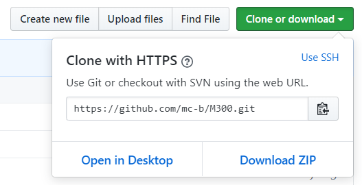

# Modul 300 - DIESDASANANAS

In dieser Dokumentation weise ich die einzelnen Kompetenzen für die verschiedenen Lernbeurteilungen nach

## Inhaltsverzeichnis

* 01 - [Toolumgebung aufsetzen](#k1)
* K2 - [Lernumgebung einrichten](#k2)
* K3 - [Vagrant Vertiefung](#k3)
* K4 - [Sicherheit implementieren](#k4)
* K5 - [Zusätzliche Bewertungspunkte](#k5)

## Toolumgebung aufsetzen <a name="k1"></a>
> [⇧ **Nach oben**](#inhaltsverzeichnis)


## Lernumgebung einrichten <a name="k2"></a>
> [⇧ **Nach oben**](#inhaltsverzeichnis)


## Vagrant Vertiefung <a name="k3"></a>
> [⇧ **Nach oben**](#inhaltsverzeichnis)

### Bestehende vm aus Vagrant-Cloud einrichten
***

1. Auf den "Clone or download" Button klicken und den Link zum klonen via HTTPS oder SSH kopieren



2. Clone-Befehl ausführen
```
    git clone https://github.com/mc-b/M300.git
```
3. Nun kann eine beliebige VM aus dem Repository ausgewählt und gestartet werden
```
    cd M300/vagrant/db/ && vagrant up
```
4. Auf diese VM kann nun mit ssh zugreifen
```
    vagrant ssh
```

### Kennt die Vagrant Befehle
***

In diesem Abschnitt sind einige Vagrant Befehle welche beim Benutzen von Vagrant oft gebraucht werden.

| Befehl | Funktion |
| ----- | ----- |
| vagrant box list | Zeigt eine Liste aller Vagrant-Boxen welche in der Vagrant-Umgebung vorhanden sind |
| vagrant box add [OS/ARCHITECTURE] | Fügt eine Vagrant-Box aus der Vagrant-Cloud hinzu |
| vagrant init [OS/ARCHITECTURE] | erstellt Vagrantfile |
| vagrant up | erstellt eine VM mithilfe des Vagrantfiles | 
| vagrant ssh [VMName] | SSH-Verbindung zur Vagrant-VM |
| vagrant halt [VMNAME] | fährt die Vagrant-VM herunter |
| vagrant destroy | fährt die Vagrant VM herunter & zerstört diese anschliessen |

### Andere, vorgefertigte VM auf eigenem Notebook aufgesetzt
***

1. Ein Directory für die neue Vagrant VM erstellen
```
mkdir Vagrant_CENTOS
```
```
cd Vagrant_CENTOS
```

2. Die bereits vorhandenen Boxen in der Vagrant-Umgebung überprüfen
```
vagrant box list
```

3. Falls die CentOS 7 Box noch nicht hinzugefügt wurde...
```
vagrant box add centos/7
```

4. Vagrantfile für die CentOS 7 Box erstellen & Box starten
```
vagrant init centos/7
```
```
vagrant up
```


### VM mit eigenem Vagrantfile aufsetzen
***

cd ./m300-davethebrave/


vagrant init centos/7

bevor wir nun die vm starten wollen wir das vagrantfile bearbeiten


Das Vagrantfile sieht mit dem Befehl "vagrant init centos/7 folgendermassen aus

insertcode

Dieses File modifizieren wir noch mit den folgenden Zeilen

### Netzwerkplan

    +-------------------------------------------------------------------------------------------------------------------------------------------------+
    | Netzwerk: 10.0.2.0/24                                                                                                                           |
    |+---------------------------------------------------------------------------------------------+                                                  |
    || Hostname: ch-web01                                                                          |                                                  |
    || OS: Ubunt  16.04 LTS                                                                        |                                                  |
    ||                                                                                             |                                                  |
    || LAN enp3s0: 10.0.2.15                                                                       |                                                  |
    || Docker docker0: 172.17.0.1                                                                  |                                                  |
    || Port: 80, 443, 8080, 8082                                                                   |                                                  |
    || NAT: 32760-32780, 80, 8080, 8081, 8082, 3306,                                               |                                                  |
    ||                                                                                             |                                                  |
    ||+-----------------------------------------+      +-----------------------------------------+ |                                                  |
    |||Jenkins Container                        |      | Apache Container                        | |                                                  |
    |||Ports: 8080, 8082                        |      | Ports: 80, 443, 8081                    | |                                                  |
    |||Version: 2.60.3                          |      | Version: 14.04                          | |                                                  |
    |||Plugins: git-client, docker-engine       |      | Plugins: -                              | |                                                  |
    |||                                         |      |                                         | |                                                  |
    |||                                         |      |                                         | |                                                  |
    ||+-----------------------------------------+   +-----------------------------------------+   +-----------------------------------------+ |       |
    |+---------------------------------------------------------------------------------------------+|
    +-----------------------------------------------------------------------------------------------+


------------------------------------------------------------

+-------------------------------------------------------------------+
|                                                                   |
|                                                                   |
|                                                                   |
|                                                                   |
|                                                                   |
|                                                                   |
|                                                                   |
|                                                                   |
|                                                                   |
|                                                                   |
|                                                                   |
|                                                                   |
|                                                                   |
|                                                                   |
+-------------------------------------------------------------------+

### Testfälle
***

nr1
vagrant ssh
hostnamectl

nr2


## Sicherheit implementieren <a name="k4"></a>
> [⇧ **Nach oben**](#inhaltsverzeichnis)

<br><br><br><br><br><br><br><br><br><br><br><br><br><br><br><br><br><br><br><br><br><br><br><br><br><br><br><br><br><br><br><br><br><br><br><br><br><br><br>

## Zusätzliche Bewertungspunkte <a name="k5"></a>
> [⇧ **Nach oben**](#inhaltsverzeichnis)

<br><br><br><br><br><br><br><br><br><br><br><br><br><br><br><br><br><br><br><br><br><br><br><br><br><br><br><br><br><br><br><br><br><br><br><br><br><br><br>
